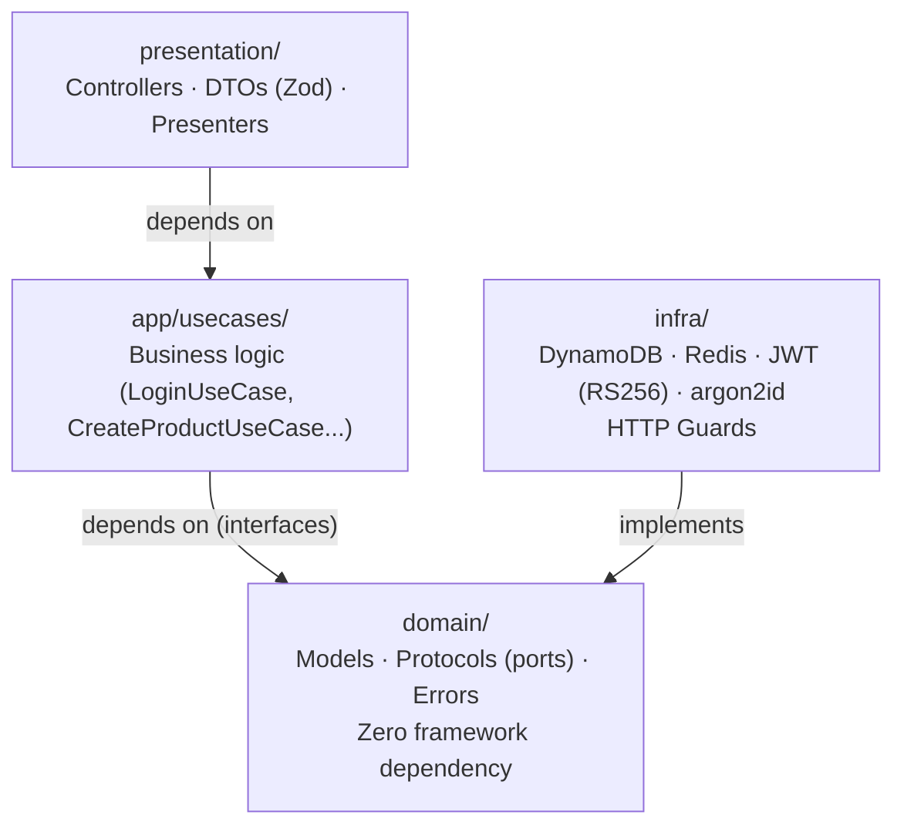

# Layered architecture

`apps/api/src/` organized by layer, not by business module — full
rationale in [`docs/PRD.md`, §4.1.3](../PRD.md).

**Dependency rule:** `domain` imports nothing from outside;
`app/usecases` depends only on interfaces from `domain/protocols`;
`infra` implements those interfaces; `presentation` depends only on
`app/usecases`. This lets business logic be tested by mocking an
interface (no real LocalStack/Redis in a unit test) and any
infrastructure piece be swapped without touching `app/` or `domain/`.
