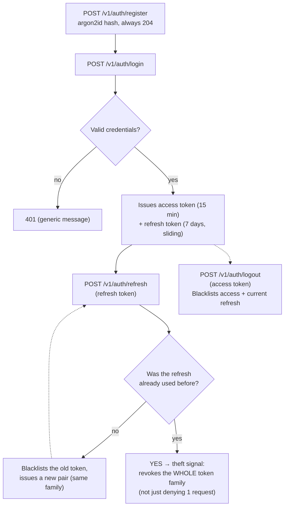
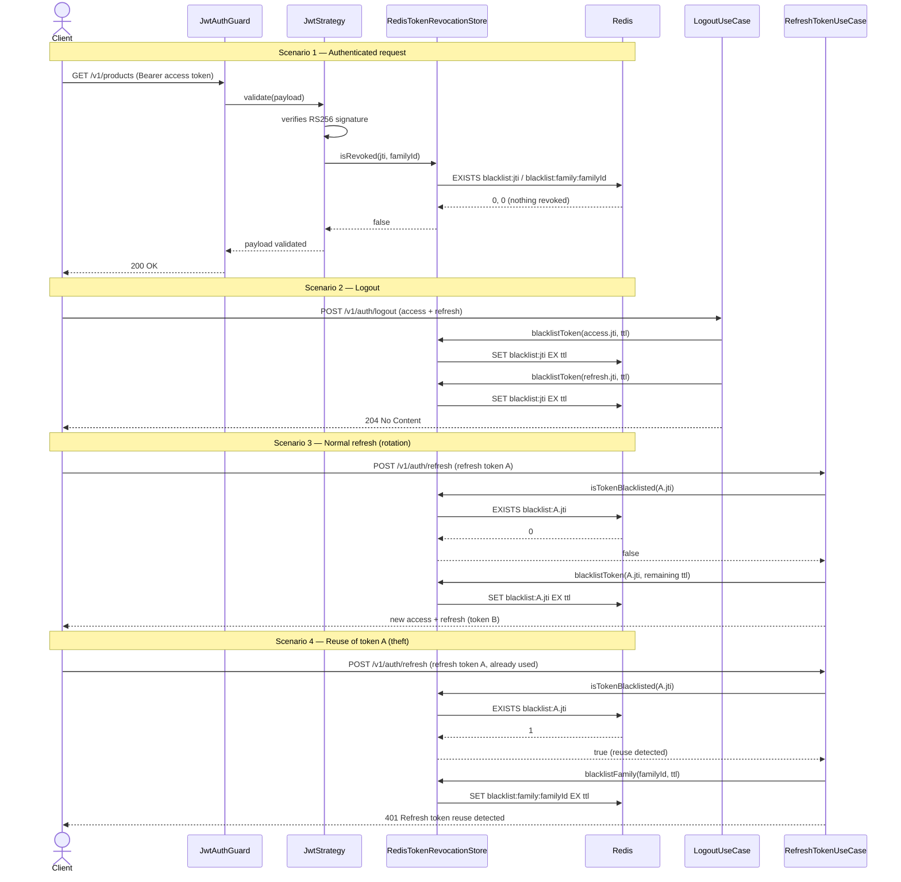

# Authentication flow

Register → login → refresh with rotation → reuse detection/cascading
revocation → logout — full rationale in
[`docs/PRD.md`, §4.6](../PRD.md).

> The "Valid credentials?" diamond covers the two cases `LoginUseCase`
> treats identically — a nonexistent user and a wrong password — always
> with the same generic `401`, so as not to leak whether an e-mail
> exists in the database (enumeration protection, see `docs/PRD.md`
> §4.6).

## Redis blacklist checks, scenario by scenario

