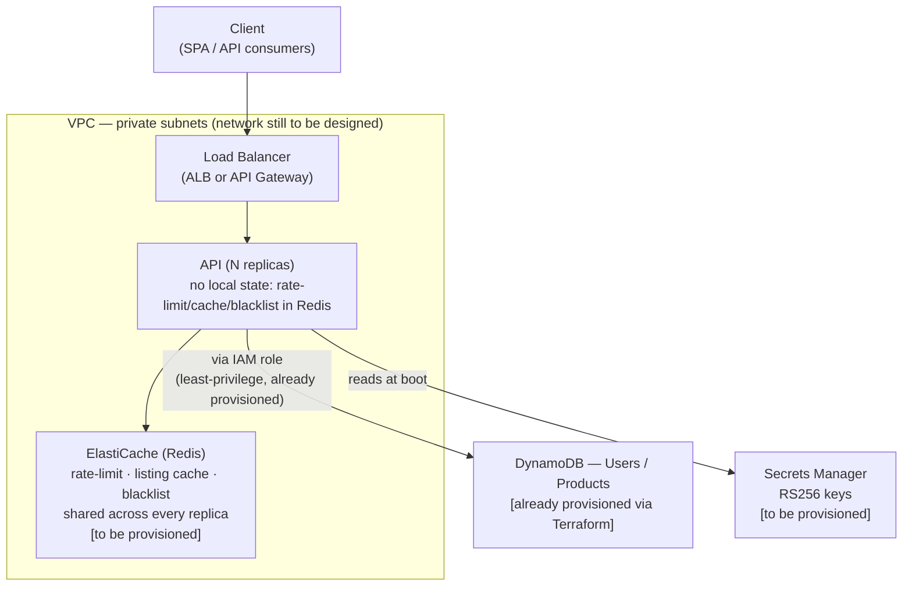

# Target deploy topology (roadmap — not implemented)

Compute, networking, and ElastiCache remain out of scope for this
delivery — full rationale in [`docs/PRD.md`, §7](../PRD.md). DynamoDB
and the access IAM role, on the other hand, **are already provisioned
via Terraform** (see [`docs/PRD.md`, §4.10](../PRD.md)) — the diagram
explicitly distinguishes the two states.

DynamoDB and Secrets Manager sit **outside** the VPC boundary on
purpose: they're managed AWS services, accessed via API/IAM — not
resources that live inside a customer VPC (unless a VPC Endpoint is
used, which isn't designed here). Without ElastiCache, rate-limit/
cache/blacklist (which depend on Redis) would run in permanent
fail-open against real data — that's the real blocker before compute,
not compute itself.
