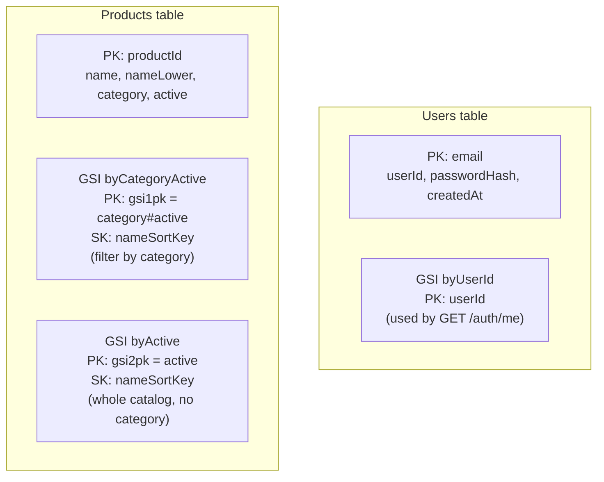
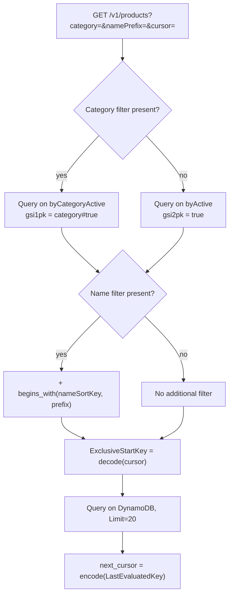

# DynamoDB modeling

Two tables, each with its own business key — no single-table design.
Full rationale in [`docs/PRD.md`, §4.1.4](../PRD.md).

## Index decision on listing (`GET /v1/products`)

`active` embedded right in the partition key of both product GSIs
avoids a `FilterExpression` — an inactive product simply isn't in the
partition being queried, instead of being filtered out after being
read (and billed for). No listing query ever uses `Scan`.
