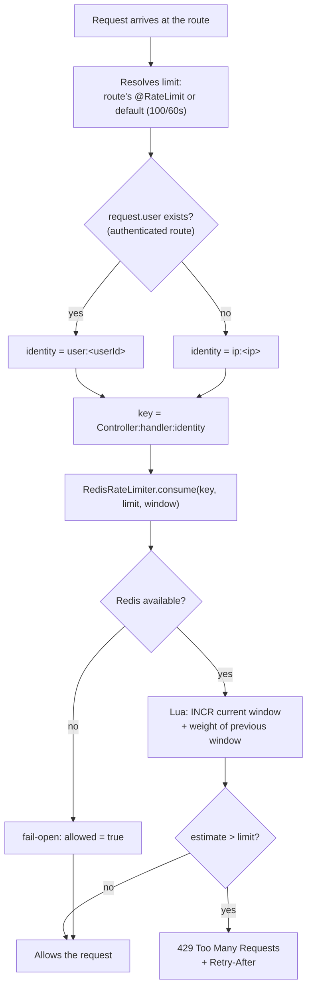
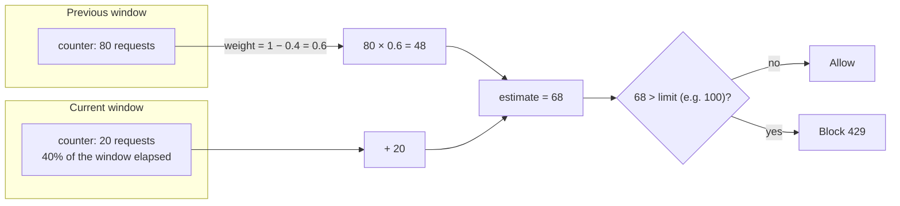

# Rate-limit: sliding window counter

Full rationale (why sliding window, why in the application instead of
delegated to AWS WAF) in [`docs/PRD.md`, §4.3](../PRD.md).

## The guard's decision, per request

## The calculation (sliding window via two fixed windows)

**Why not a fixed window:** a counter that resets abruptly allows up
to 2x the limit by concentrating requests around the reset. The
sliding window carries weight from the previous window, closing that
gap — the same behavior as an AWS WAF rate-based rule, without
delegating execution to it.
